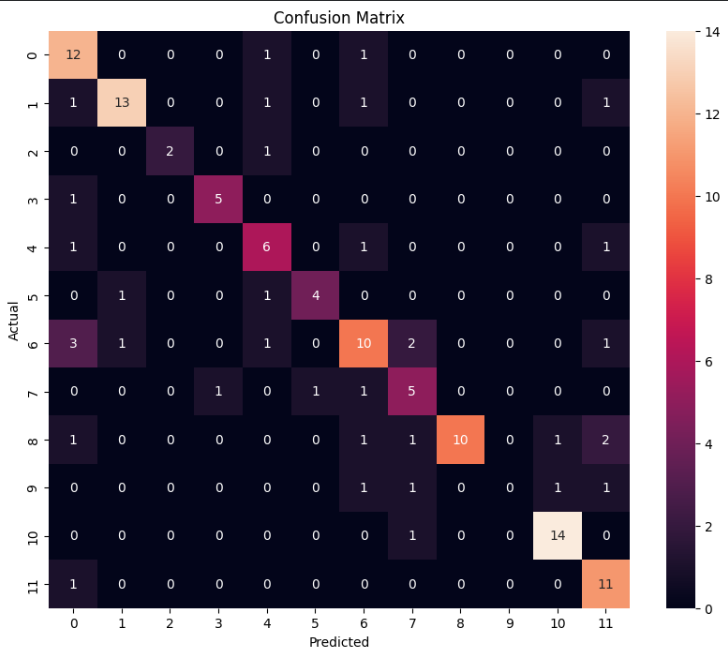
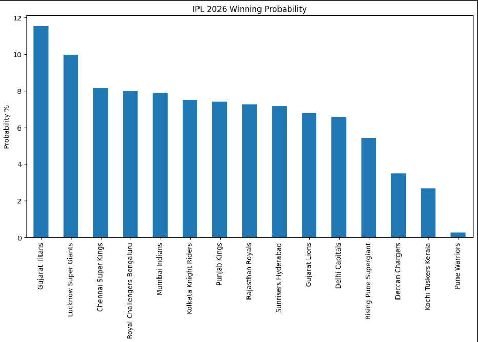
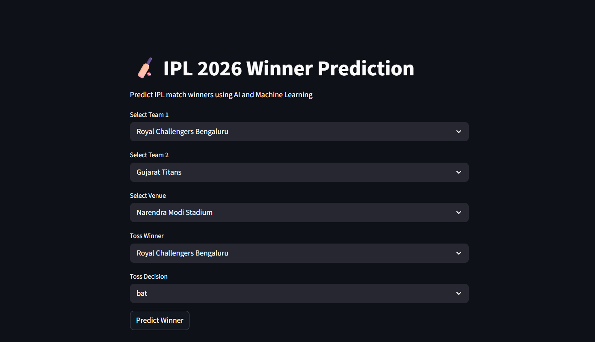

# 🏏 IPL Match Prediction Using Machine Learning

This project predicts IPL match outcomes using Machine Learning models trained on historical IPL datasets.  
The system uses feature engineering, statistical analysis, and advanced ML algorithms like Random Forest and XGBoost to estimate winning probabilities and predict IPL match winners.

---

# 🌐 Live Demo

👉 [Open Streamlit App](https://ipl-match-prediction-ashmit.streamlit.app/)

---

# 📌 Features

- IPL winner prediction
- Feature engineering using match statistics
- Random Forest and XGBoost models
- Team strength analysis
- Winning probability visualization
- Confusion matrix and model evaluation
- Streamlit web application
- IPL 2026 winner prediction

---

# 🛠 Technologies Used

- Python
- Pandas
- NumPy
- Matplotlib
- Seaborn
- Scikit-learn
- XGBoost
- Streamlit
- Jupyter Notebook / Google Colab

---

# 📊 Dataset

The project uses historical IPL datasets updated till IPL 2025, including:

- Match-level dataset
- Ball-by-ball delivery dataset

These datasets are used for:
- Team performance analysis
- Toss impact analysis
- Batting strength calculation
- Bowling strength calculation
- Match winner prediction

---

# 🤖 Machine Learning Models

The following ML models were used:

- Random Forest Classifier
- XGBoost Classifier

The models were trained and evaluated using:
- Train-Test Split
- Accuracy Score
- Confusion Matrix
- Classification Report

---

# 📈 Model Performance

| Model | Accuracy |
|---|---|
| Random Forest | 71% |
| XGBoost | 92% |

---

# 📸 Project Screenshots

## Confusion Matrix


## Winning Probability Graph


## Streamlit Web App


---

# 📁 Project Structure

```text
ipl-match-prediction-ml/
│
├── data/
│   ├── matches_updated_ipl_upto_2025.csv
│   └── deliveries_updated_ipl_upto_2025.csv
│
├── notebooks/
│   └── ipl_match_prediction_ml.ipynb
│
├── models/
│   ├── ipl_random_forest.pkl
│   ├── ipl_xgboost.pkl
│   ├── advanced_ipl_xgboost.pkl
│   └── encoders.pkl
│
├── images/
│   ├── confusion_matrix.png
│   ├── probability_graph.png
│   └── streamlit_app.png
│
├── app.py
├── requirements.txt
├── README.md
└── .gitignore
```

---

# ▶️ How to Run the Project

## Clone Repository

```bash
git clone https://github.com/ashmitcodes20/ipl-match-prediction-ml.git
```

---

## Install Requirements

```bash
pip install -r requirements.txt
```

---

## Run Streamlit App

```bash
streamlit run app.py
```

---

# 🚀 Future Improvements

- Real-time IPL API integration
- Better prediction accuracy
- Advanced deep learning models
- Player performance prediction
- Interactive dashboard
- Cloud deployment

---

# 👨‍💻 Author

**Ashmit Shingarwade**  
Computer Science Engineering Student  
MIT ADT University

---

# ⭐ Project Highlights

- End-to-end Machine Learning workflow
- Advanced feature engineering
- Data visualization and analytics
- Model evaluation and comparison
- Streamlit deployment integration
- Real-world sports analytics application
```
